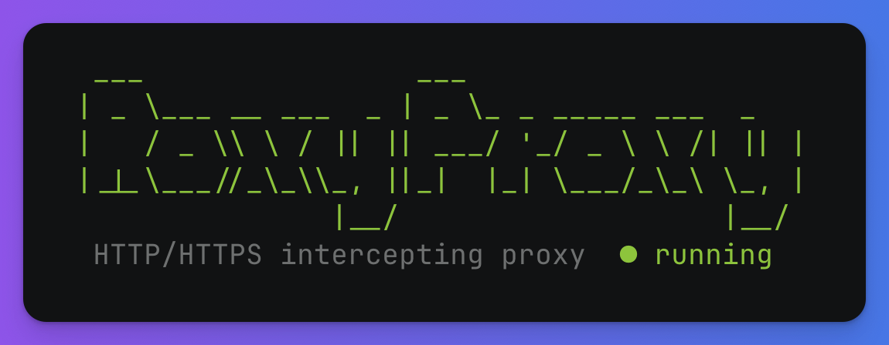
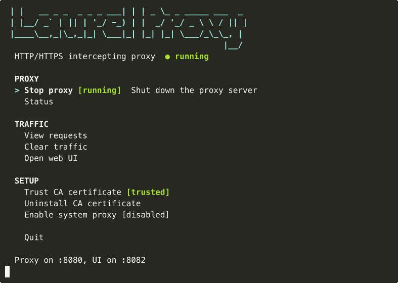

<p align="center">
  
</p>

<p align="center">
  HTTP/HTTPS intercepting proxy with a CLI and web UI.<br>
  Captures traffic, stores it in SQLite, and makes it queryable -- by humans and LLMs alike.
</p>

## Table of Contents

- [Installation](#installation)
- [Claude Code Plugin](#claude-code-plugin)
- [Quick Start](#quick-start)
- [Interactive Mode](#interactive-mode)
- [CLI Commands](#cli-commands)
  - [start](#start)
  - [stop](#stop)
  - [status](#status)
  - [requests](#requests)
  - [request](#request)
  - [clear](#clear)
  - [trust-ca](#trust-ca)
  - [uninstall-ca](#uninstall-ca)
  - [proxy-on](#proxy-on-macos)
  - [proxy-off](#proxy-off-macos)
- [Web UI](#web-ui)
- [HTTPS Interception](#https-interception)
- [System Proxy](#system-proxy-macos)
- [Configuration](#configuration)
- [REST API](#rest-api)
- [Architecture](#architecture)
- [Development](#development)

---

## Installation

Run directly without installing:

```bash
npx @rvanbaalen/roxyproxy
```

Or install globally:

```bash
npm install -g @rvanbaalen/roxyproxy
roxyproxy
```

### From source

```bash
git clone https://github.com/rvanbaalen/roxyproxy.git
cd roxyproxy
npm install
npm run build
npm link
```

## Claude Code Plugin

RoxyProxy ships with a [Claude Code](https://docs.anthropic.com/en/docs/claude-code) plugin. Once installed, Claude knows all RoxyProxy commands, filters, API endpoints, and common debugging workflows.

### Install

```
/plugin marketplace add rvanbaalen/roxyproxy
```

Then open the plugin browser and install roxyproxy:

```
/plugin
```

### What it provides

After installation, Claude can help you:

- Start/stop the proxy and configure HTTPS interception
- Write `roxyproxy requests` queries with the right filter flags
- Use the REST API to query captured traffic programmatically
- Debug failing API calls by inspecting captured request/response pairs
- Set up system-wide proxy routing on macOS

Just ask Claude anything about intercepting or inspecting HTTP traffic and it will use its knowledge of RoxyProxy to help.

## Quick Start

```bash
# Start the proxy (default: proxy on :8080, web UI on :8081)
roxyproxy start

# Route traffic through it
curl -x http://127.0.0.1:8080 http://httpbin.org/get

# View captured traffic
roxyproxy requests --format table

# Open the web UI
open http://127.0.0.1:8081

# Stop
roxyproxy stop
```

For HTTPS interception, trust the CA certificate first:

```bash
roxyproxy start
roxyproxy trust-ca
curl -x http://127.0.0.1:8080 https://api.example.com/endpoint
```

## Interactive Mode

Running `roxyproxy` with no arguments launches an interactive terminal menu:

```bash
roxyproxy
```



The interactive menu provides access to all features:

- **Start/Stop proxy** -- toggle the proxy server on and off
- **Status** -- view proxy stats (port, request count, DB size)
- **View requests** -- browse captured traffic in the terminal
- **Clear traffic** -- delete all captured requests
- **Open web UI** -- opens the dashboard in your browser (auto-starts the proxy if needed)
- **Trust CA certificate** -- install the CA cert for HTTPS interception
- **Enable/Disable system proxy** -- route all macOS traffic through RoxyProxy
- **Quit** -- stop the proxy and exit

Use arrow keys to navigate and Enter to select. Press `q` or Ctrl+C to quit.

The interactive mode stays in sync with the web UI -- if you stop the proxy from the web dashboard, the CLI menu updates within a second, and vice versa.

---

## CLI Commands

### start

Start the proxy server in the foreground.

```bash
roxyproxy start [options]
```

| Option | Default | Description |
|---|---|---|
| `--port <number>` | `8080` | Proxy listening port |
| `--ui-port <number>` | `8081` | Web UI and API port |
| `--db-path <path>` | `~/.roxyproxy/data.db` | SQLite database location |

```bash
# Default ports
roxyproxy start

# Custom ports
roxyproxy start --port 9000 --ui-port 9001

# Custom database location
roxyproxy start --db-path /tmp/proxy.db
```

The process writes its PID to `~/.roxyproxy/pid` and responds to SIGINT/SIGTERM for graceful shutdown.

### stop

Stop the running proxy server.

```bash
roxyproxy stop [options]
```

| Option | Default | Description |
|---|---|---|
| `--ui-port <number>` | `8081` | API port to send shutdown request to |

Sends a graceful shutdown request via the API. Falls back to SIGTERM via the PID file if the API is unreachable.

```bash
roxyproxy stop
roxyproxy stop --ui-port 9001
```

### status

Show proxy status.

```bash
roxyproxy status [options]
```

| Option | Default | Description |
|---|---|---|
| `--ui-port <number>` | `8081` | API port to query |

```bash
roxyproxy status
```

Output:

```
Status     Running
Proxy      port 8080
Requests   142
DB Size    3.2MB
```

### requests

Query captured requests from the database.

```bash
roxyproxy requests [options]
```

| Option | Default | Description |
|---|---|---|
| `--host <pattern>` | | Filter by hostname (substring match) |
| `--status <code>` | | Filter by HTTP status code |
| `--method <method>` | | Filter by HTTP method |
| `--search <pattern>` | | Search URLs (substring match) |
| `--since <time>` | | After this time (Unix ms or ISO date) |
| `--until <time>` | | Before this time (Unix ms or ISO date) |
| `--limit <n>` | `100` | Maximum number of results |
| `--format <format>` | `json` | Output format: `json` or `table` |
| `--db-path <path>` | `~/.roxyproxy/data.db` | Database location |

The default JSON output is designed for piping to `jq` or feeding to LLMs:

```bash
# All 500 errors
roxyproxy requests --status 500

# POST requests to a specific host
roxyproxy requests --host api.example.com --method POST

# Search URLs
roxyproxy requests --search "/api/v2"

# Human-readable table
roxyproxy requests --format table --limit 20

# Time-bounded query
roxyproxy requests --since "2024-01-15T00:00:00Z" --until "2024-01-16T00:00:00Z"

# Pipe to jq
roxyproxy requests --host stripe.com | jq '.data[].url'
```

### request

Show full details of a single captured request, including headers and bodies.

```bash
roxyproxy request <id> [options]
```

| Option | Default | Description |
|---|---|---|
| `--format <format>` | `json` | Output format: `json` or `table` |
| `--db-path <path>` | `~/.roxyproxy/data.db` | Database location |

```bash
roxyproxy request a1b2c3d4-e5f6-7890-abcd-ef1234567890
roxyproxy request a1b2c3d4-e5f6-7890-abcd-ef1234567890 --format table
```

### clear

Delete all captured traffic from the database.

```bash
roxyproxy clear [options]
```

| Option | Default | Description |
|---|---|---|
| `--ui-port <number>` | `8081` | API port |

```bash
roxyproxy clear
```

### trust-ca

Install and trust the RoxyProxy CA certificate for HTTPS interception.

```bash
roxyproxy trust-ca [options]
```

| Option | Description |
|---|---|
| `--no-interactive` | Skip prompts; print cert path and manual instructions |

```bash
# Interactive (prompts for sudo password)
roxyproxy trust-ca

# Non-interactive (CI, scripts)
roxyproxy trust-ca --no-interactive
```

See [HTTPS Interception](#https-interception) for details.

### uninstall-ca

Remove the RoxyProxy CA certificate from the system trust store.

```bash
roxyproxy uninstall-ca [options]
```

| Option | Description |
|---|---|
| `--no-interactive` | Skip prompts; print removal instructions |

```bash
# Interactive (prompts for sudo password)
roxyproxy uninstall-ca

# Non-interactive
roxyproxy uninstall-ca --no-interactive
```

On macOS, removes via `security remove-trusted-cert`. On Linux, removes from `/usr/local/share/ca-certificates/` and refreshes the store. Only available when the certificate is currently installed.

### proxy-on (macOS)

Configure RoxyProxy as the system-wide HTTP/HTTPS proxy.

```bash
roxyproxy proxy-on [options]
```

| Option | Default | Description |
|---|---|---|
| `--port <number>` | `8080` | Proxy port |
| `--service <name>` | auto-detected | Network service (e.g., "Wi-Fi", "Ethernet") |

```bash
roxyproxy proxy-on
roxyproxy proxy-on --port 9000 --service "Wi-Fi"
```

### proxy-off (macOS)

Remove RoxyProxy from system proxy settings.

```bash
roxyproxy proxy-off [options]
```

| Option | Default | Description |
|---|---|---|
| `--service <name>` | auto-detected | Network service |

```bash
roxyproxy proxy-off
```

---

## Web UI

Available at `http://127.0.0.1:8081` when the proxy is running.

### Features

- **Live traffic stream** -- requests appear in real-time via Server-Sent Events
- **Historical traffic** -- previously captured requests load on page open
- **Sortable columns** -- click any column header to sort (Time, Method, Status, Host, Path, Duration, Size)
- **Resizable columns** -- drag column borders to adjust widths
- **Request detail panel** -- click any row to inspect headers and response body in a resizable side panel
- **Filters** -- filter by host, status code, HTTP method, or URL search
- **Proxy controls** -- start/stop the proxy and clear traffic directly from the UI
- **Live sync** -- start/stop state is synchronized between the web UI and CLI in real-time

### Keyboard Shortcuts

The filter bar is always accessible. Type in any filter field to narrow results instantly.

---

## HTTPS Interception

RoxyProxy performs HTTPS interception via a local Certificate Authority (CA).

### How it works

1. On first startup, RoxyProxy generates a root CA certificate and private key at `~/.roxyproxy/ca/`
2. When a client sends a CONNECT request (HTTPS), RoxyProxy:
   - Accepts the tunnel
   - Generates a per-domain certificate signed by the CA on the fly
   - Terminates TLS with the client using the generated cert
   - Opens a separate TLS connection to the real server
   - Forwards traffic in both directions, capturing it along the way

### Setup

**Step 1: Start the proxy** (generates the CA if it doesn't exist)

```bash
roxyproxy start
```

**Step 2: Trust the CA certificate**

```bash
roxyproxy trust-ca
```

This runs the platform-specific trust command:

| Platform | What happens |
|---|---|
| **macOS** | Adds to System Keychain via `security add-trusted-cert` (requires sudo) |
| **Linux** | Copies to `/usr/local/share/ca-certificates/` and runs `update-ca-certificates` (requires sudo) |
| **Firefox** | Must be done manually: Settings > Privacy & Security > Certificates > View Certificates > Import `~/.roxyproxy/ca/ca.crt` |

**Step 3: Route HTTPS traffic through the proxy**

```bash
# Via explicit proxy flag
curl -x http://127.0.0.1:8080 https://api.example.com/data

# Or enable system-wide proxy (macOS)
roxyproxy proxy-on
```

### Certificate Details

| Property | Value |
|---|---|
| CA location | `~/.roxyproxy/ca/ca.crt` and `ca.key` |
| CA validity | 10 years |
| CA subject | "RoxyProxy CA" |
| Per-domain cert validity | 1 year |
| Key size | 2048-bit RSA |
| Signature algorithm | SHA-256 |
| Domain cert cache | LRU, default 500 entries (configurable) |

---

## System Proxy (macOS)

On macOS, RoxyProxy can configure itself as the system-wide HTTP/HTTPS proxy. This routes all traffic from most applications through the proxy without needing per-app configuration.

```bash
# Enable
roxyproxy proxy-on

# Disable
roxyproxy proxy-off
```

This uses `networksetup` to set the proxy on your active network service (auto-detects Wi-Fi, Ethernet, or the first available interface).

---

## Configuration

Configuration is loaded from (highest priority first):

1. CLI flags
2. `~/.roxyproxy/config.json`
3. Built-in defaults

### Config file

Create `~/.roxyproxy/config.json`:

```json
{
  "proxyPort": 8080,
  "uiPort": 8081,
  "dbPath": "~/.roxyproxy/data.db",
  "maxAge": "7d",
  "maxDbSize": "500MB",
  "maxBodySize": "1MB",
  "certCacheSize": 500
}
```

### Options

| Field | Default | Description |
|---|---|---|
| `proxyPort` | `8080` | Proxy listening port |
| `uiPort` | `8081` | Web UI and REST API port |
| `dbPath` | `~/.roxyproxy/data.db` | SQLite database file path (supports `~`) |
| `maxAge` | `7d` | Auto-delete requests older than this |
| `maxDbSize` | `500MB` | Auto-delete oldest requests when DB exceeds this size |
| `maxBodySize` | `1MB` | Truncate request/response bodies larger than this |
| `certCacheSize` | `500` | Max per-domain SSL certificates cached in memory |

### Size and duration formats

Sizes accept: raw bytes (`1048576`), or human units (`1KB`, `10MB`, `1GB`).

Durations accept: raw milliseconds (`86400000`), or human units (`1s`, `5m`, `1h`, `7d`).

### Auto-cleanup

A background job runs every 5 minutes to enforce `maxAge` and `maxDbSize`:

- Deletes requests older than `maxAge`
- If the database still exceeds `maxDbSize`, deletes the oldest requests in batches
- Runs incremental vacuum to reclaim disk space

---

## REST API

The API is available at `http://127.0.0.1:8081/api` when the proxy is running.

### Endpoints

#### `GET /api/requests`

Query captured requests. Returns paginated results.

Query parameters match the CLI `requests` command: `host`, `status`, `method`, `content_type`, `search`, `since`, `until`, `limit`, `offset`.

```bash
# All requests
curl http://127.0.0.1:8081/api/requests

# Filtered
curl "http://127.0.0.1:8081/api/requests?host=example.com&status=200&limit=50"
```

Response:

```json
{
  "data": [ { "id": "...", "timestamp": 1700000000000, "method": "GET", ... } ],
  "total": 142,
  "limit": 100,
  "offset": 0
}
```

#### `GET /api/requests/:id`

Get full details for a single request, including headers and base64-encoded bodies.

```bash
curl http://127.0.0.1:8081/api/requests/a1b2c3d4-e5f6-7890-abcd-ef1234567890
```

#### `DELETE /api/requests`

Delete all captured traffic.

```bash
curl -X DELETE http://127.0.0.1:8081/api/requests
```

#### `GET /api/status`

Get proxy status.

```bash
curl http://127.0.0.1:8081/api/status
```

Response:

```json
{
  "running": true,
  "proxyPort": 8080,
  "requestCount": 142,
  "dbSizeBytes": 3358720
}
```

#### `POST /api/proxy/start`

Start the proxy server.

```bash
curl -X POST http://127.0.0.1:8081/api/proxy/start
```

#### `POST /api/proxy/stop`

Stop the proxy server (the API remains available).

```bash
curl -X POST http://127.0.0.1:8081/api/proxy/stop
```

#### `POST /api/shutdown`

Shut down the entire process (proxy + API + web UI).

```bash
curl -X POST http://127.0.0.1:8081/api/shutdown
```

#### `GET /api/events`

Server-Sent Events stream for real-time updates.

```bash
curl -N http://127.0.0.1:8081/api/events
```

Events are named:

- `event: request` -- new captured request (data is the request record as JSON)
- `event: status` -- proxy state change (data is `{"running": true/false, "proxyPort": 8080}`)

---

## Architecture

```
                    ┌─────────────────────────────────────────┐
                    │              RoxyProxy                   │
                    │                                         │
  HTTP/S traffic    │  ┌──────────────┐    ┌──────────────┐  │
 ─────────────────► │  │ Proxy Server │───►│  EventManager │  │
                    │  │    :8080     │    │  (pub/sub)    │──┼──► SSE to Web UI
                    │  └──────┬───────┘    └──────────────┘  │
                    │         │                               │
                    │         ▼                               │
                    │  ┌──────────────┐    ┌──────────────┐  │
                    │  │   SQLite DB  │◄───│   Cleanup    │  │
                    │  │  (batched)   │    │  (5 min)     │  │
                    │  └──────┬───────┘    └──────────────┘  │
                    │         │                               │
                    │         ▼                               │
                    │  ┌──────────────┐    ┌──────────────┐  │
                    │  │  REST API    │    │   Web UI     │  │
                    │  │  /api/*      │    │  (React)     │  │
                    │  │    :8081     │    │    :8081     │  │
                    │  └──────────────┘    └──────────────┘  │
                    └─────────────────────────────────────────┘
```

### Key design decisions

- **SQLite with WAL mode** -- high write throughput with concurrent reads
- **Batched writes** -- requests are queued in memory and flushed every 100ms to reduce I/O
- **Event batching** -- SSE events are buffered for 100ms before flushing to connected clients
- **Response decompression** -- gzip, deflate, and brotli responses are automatically decompressed before storage
- **Body truncation** -- configurable max body size prevents storage bloat; a `truncated` flag is set on affected records
- **Per-domain cert caching** -- LRU cache avoids regenerating SSL certificates for frequently accessed domains

### Data storage

All data is stored in `~/.roxyproxy/data.db` (SQLite). The `requests` table has indexes on `timestamp`, `host`, `status`, `path`, and `content_type` for fast querying.

Request and response bodies are stored as binary blobs. In the API and SSE stream, they are base64-encoded.

### Files

| Path | Purpose |
|---|---|
| `~/.roxyproxy/data.db` | SQLite database |
| `~/.roxyproxy/config.json` | Configuration file (optional) |
| `~/.roxyproxy/ca/ca.crt` | Root CA certificate |
| `~/.roxyproxy/ca/ca.key` | Root CA private key |
| `~/.roxyproxy/pid` | Process ID file |

---

## Development

```bash
# Run all tests
npm test

# Watch mode
npm run test:watch

# Build server (TypeScript)
npm run build:server

# Build web UI (Vite + React)
npm run build:ui

# Build everything
npm run build

# Vite dev server with API proxy to :8081
npm run dev:ui
```

### Project structure

```
src/
├── cli/                # CLI entry point, commands, interactive mode
│   ├── index.ts        # Command registration (Commander.js)
│   ├── interactive.tsx  # Interactive terminal menu (Ink/React)
│   ├── commands/       # Individual CLI commands
│   └── system-proxy.ts # macOS system proxy & CA management
├── server/             # Proxy server, API, SSL, events
│   ├── index.ts        # RoxyProxyServer orchestrator
│   ├── proxy.ts        # HTTP/HTTPS intercepting proxy
│   ├── api.ts          # Express REST API + SSE
│   ├── ssl.ts          # CA generation & per-domain cert caching
│   ├── events.ts       # Pub/sub event manager
│   └── config.ts       # Config loading and merging
├── storage/            # Database and cleanup
│   ├── db.ts           # SQLite operations (better-sqlite3)
│   └── cleanup.ts      # Auto-cleanup job
├── shared/             # Shared TypeScript types
│   └── types.ts        # Config, RequestRecord, RequestFilter
└── ui/                 # React web UI (Vite)
    ├── App.tsx          # Main app component
    ├── api.ts           # API client + SSE hook
    └── components/      # UI components
```
